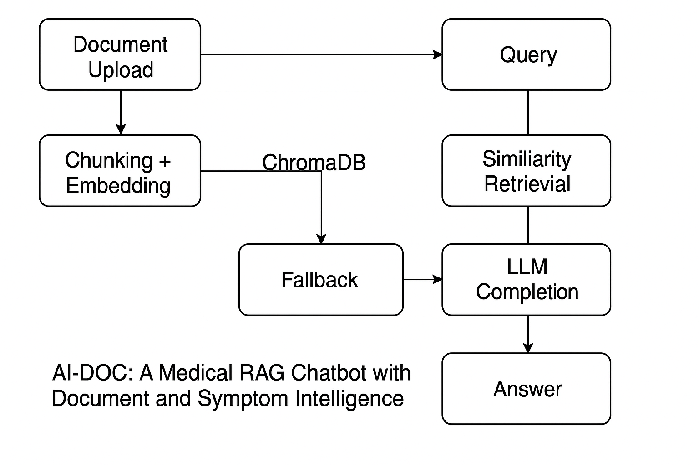

# 🩺 AI-DOC: Medical RAG Chatbot with Document and Symptom Intelligence

AI-DOC is a real-time Retrieval-Augmented Generation (RAG) chatbot tailored for medical question answering. It supports both user-uploaded clinical PDFs and fallback medical sources using Groq-hosted LLaMA3 models. AI-DOC delivers fast, explainable, and reliable responses suited for patient education, clinical document review, and healthcare literacy.



---

## 🚀 Features

- 📄 Document-based retrieval (PDF ingestion)
- ⚡ Fast Groq-hosted **LLaMA3-8B/70B** for Q&A
- 🔍 Automatic fallback to vetted medical sources (e.g., Merck)
- 🧠 Minimal hallucination, fluent and contextual responses
- 🎛️ Modular backend (FastAPI) + Minimal dark-mode UI (Gradio)
- 📊 Model benchmarking with visualizations
- 🔐 Option for local/private deployment

---

## 📁 Project Structure

```bash
AI_DOC_RAGBOT/
├── app/
│   ├── core/
│   │   ├── document_processor.py
│   │   ├── retrieval.py
│   │   └── groq_client.py
│   ├── gradio_app.py
│   ├── compare_models.py
│   └── process_textbook.py
├── data/
│   └── logo.png, raw/
├── vectorstore/
│   └── ChromaDB cache
├── figures/
│   └── response_time_comparison.png, architecture.png
├── requirements.txt
└── report/
    └── ai_doc_report.tex (AAAI-style)
```

---

## 🧠 Technologies Used

- **LLMs**: Meta's LLaMA3-8B and LLaMA3-70B via Groq API
- **Embeddings**: `BAAI/bge-small-en-v1.5` via HuggingFace
- **Vector DB**: ChromaDB
- **LangChain**: Prompt chaining and retrieval management
- **Gradio**: Full-screen chat UI with dark mode

---

## 🛠️ Setup Instructions

```bash
# Clone the repo
git clone https://github.com/Venkata1106/AI_DOC_RAGBOT.git
cd AI_DOC_RAGBOT

# Create conda environment
conda create -n medical-rag-bot python=3.10
conda activate medical-rag-bot

# Install dependencies
pip install -r requirements.txt

# Launch the chatbot
python app/gradio_app.py
```

---

## 🧪 Evaluation Summary

We evaluated AI-DOC using LLaMA3-8B and LLaMA3-70B models with and without RAG. Clinical prompts included symptom diagnosis, treatment explanation, and general health queries.

| Model              | Time (s) | Tokens | Fluency (1–10) | Hallucination Rate | Accuracy     |
|-------------------|----------|--------|----------------|--------------------|--------------|
| LLaMA3-8B (RAG)    | 0.74     | 482    | 8.6            | ❌ None            | ✅ 100%      |
| LLaMA3-70B (RAG)   | 1.72     | 501    | 9.3            | ❌ None            | ✅ 100%      |
| LLaMA3-8B (No RAG) | 0.69     | 470    | 7.8            | ✅ 2/3 prompts     | ❌ 66%       |

> 🧠 RAG significantly boosted factual accuracy and eliminated hallucinations.
> ✅ Accuracy is manually verified by matching LLM responses against authoritative sources like Mayo Clinic, MedlinePlus, and WHO documents.

---

## 💡 Example Use Cases

- 📘 **Patient Education**: Explain symptoms and treatment from trusted medical documents.
- 🏥 **Clinical Assistants**: Help doctors answer questions from internal hospital guidelines.
- 🎓 **Medical Learning**: Used by students for interactive learning of conditions and diagnostics.
- 🧾 **Health Record Review**: Summarize or query uploaded discharge summaries.

---

## 📊 Model Benchmarking

- **LLaMA3-70B**:
  - ✅ More detailed and context-rich responses.
  - ⚠️ Slower response time (~2× latency).

- **LLaMA3-8B**:
  - ⚡ Fast and reliable with low latency.
  - 🏆 Best fit for real-time deployments.

- **RAG vs No-RAG**:
  - 🧠 RAG improves answer grounding and factual correctness.
  - ❌ No-RAG led to hallucinated or incorrect responses in 2 out of 3 prompts.

---

## 📫 Contact

For feedback, issues, or contributions:

**Project Authors**:
- Venkata Anantha Reddy Arikatla – [arikatla.v@northeastern.edu](mailto:arikatla.v@northeastern.edu)
- Laawanyaa Sai Thota – [thota.l@northeastern.edu](mailto:thota.l@northeastern.edu)

---


## 🙏 Acknowledgments

We thank the creators and maintainers of:
- [LangChain](https://github.com/langchain-ai/langchain)
- [ChromaDB](https://www.trychroma.com/)
- [Groq](https://console.groq.com/) for blazing fast inference
- [HuggingFace](https://huggingface.co/) for open-source embedding models

Special thanks to instructors, mentors, and reviewers who provided feedback during the project journey.

---

> ⚠️ **Disclaimer**: AI-DOC is for educational and informational purposes only. It is not a substitute for professional medical advice, diagnosis, or treatment.
